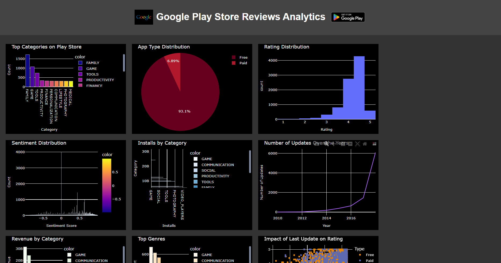
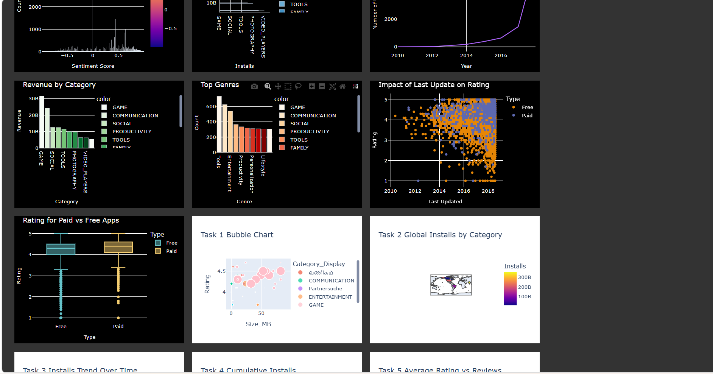
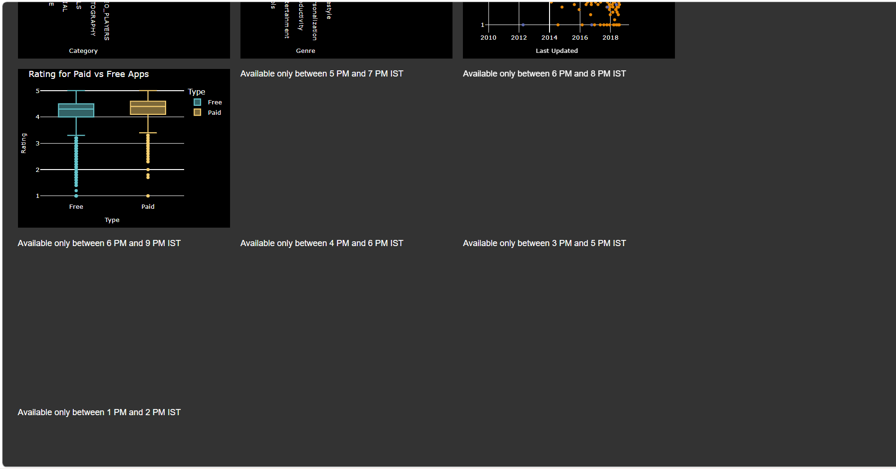
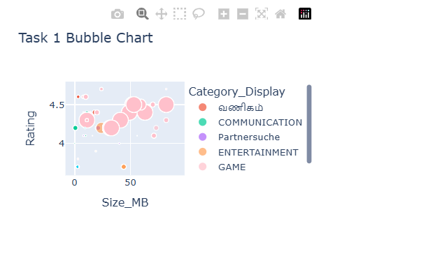
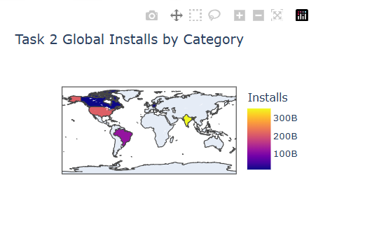
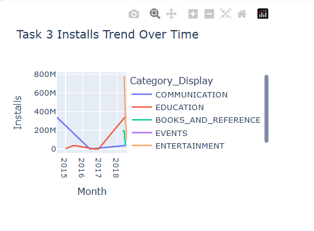
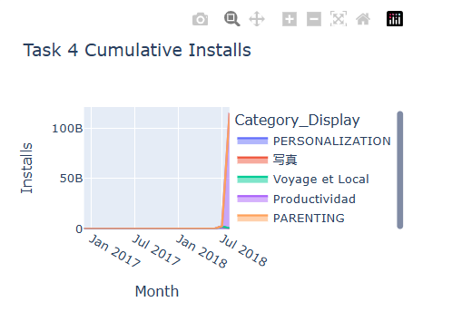
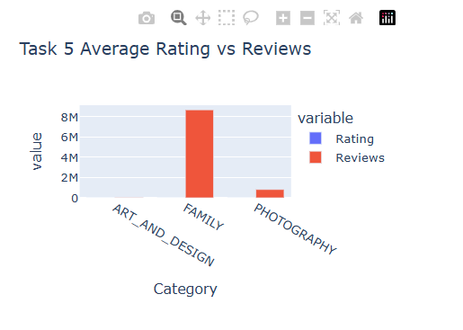
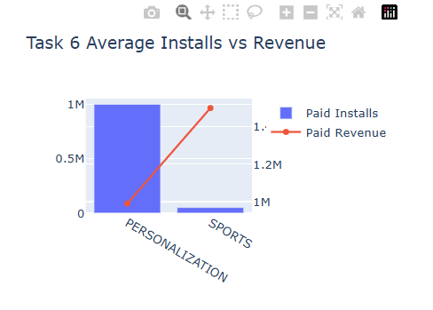

# Google playstore data analytics

## Project Overview

This project analyzes Google Play Store applications and user reviews using Python, Pandas, and Plotly.

The project consists of:

- Training Dashboard Visualizations
- Internship Task Implementations
- Interactive Plotly Dashboards
- Data Cleaning and Transformation
- Category-Based Analytics
- Revenue Analysis
- Install Trend Analysis
- Time-Based Dashboard Restrictions

---

## Dataset

### Files Used

- Play Store Data.csv
- User Reviews.csv

The datasets contain information related to:

- App Name
- Category
- Rating
- Reviews
- Installs
- Price
- Size
- Android Version
- Content Rating
- User Sentiment

---

## Technologies Used

- Python
- Pandas
- NumPy
- Plotly
- Plotly Express
- Jupyter Notebook
- HTML Dashboard

---

## Training Dashboard

The training project includes visualizations such as:

1. Rating Distribution by App Type
2. Category Analysis
3. Genre Analysis
4. Last Updated vs Rating
5. Global Installs Analysis
6. Installs Trend Analysis
7. Revenue Analysis
8. Review Analytics
9. Rating Analytics
10. Additional Category Insights

---

## Internship Tasks

### Task 1 – Bubble Chart

Visualizes:

- App Size vs Rating
- Bubble Size represents Installs
- Category translations:
  - Beauty → Hindi
  - Business → Tamil
  - Dating → German
- Review and Sentiment filtering
- Install filtering

Time Restriction:
- Visible only between 5 PM and 7 PM IST

---

### Task 2 – Choropleth Map

Visualizes:

- Global Installs by Category
- Top 5 Categories
- High Install Categories Highlighted

Time Restriction:
- Visible only between 6 PM and 8 PM IST

---

### Task 3 – Time Series Line Chart

Visualizes:

- Install Trends Over Time
- Category-wise Growth Analysis

Time Restriction:
- Visible only between 6 PM and 9 PM IST

---

### Task 4 – Stacked Area Chart

Visualizes:

- Cumulative Installs Over Time
- Category Translations:
  - Travel & Local → French
  - Productivity → Spanish
  - Photography → Japanese

Time Restriction:
- Visible only between 4 PM and 6 PM IST

---

### Task 5 – Grouped Bar Chart

Visualizes:

- Average Rating
- Total Reviews
- Top Categories by Installs

Time Restriction:
- Visible only between 3 PM and 5 PM IST

---

### Task 6 – Dual Axis Chart

Visualizes:

- Average Installs
- Revenue Comparison
- Free vs Paid Apps

Time Restriction:
- Visible only between 1 PM and 2 PM IST

---

## Notebooks Included

### analysis2.ipynb

Contains:

- Internship Task Analysis
- Visualizations without time restrictions
- Used for development and testing

### Google_Play_Store_Training_And_Internship.ipynb

Contains:

- Complete Training Project
- Internship Tasks
- Time Restriction Logic
- Final Dashboard Implementation

---

## Repository Structure

```text
google-playstore-data-analytics/
│
├── analysis2.ipynb
├── Google_Play_Store_Training_And_Internship.ipynb
├── Play Store Data.csv
├── User Reviews.csv
├── README.md
│
└── screenshot/
    ├── dashboard2.png
    ├── dashboard3.png
    ├── trainingdashboard.png
    ├── timerestrictions.png
    ├── task1.png
    ├── task2.png
    ├── task3.png
    ├── task4.png
    ├── task5.png
    └── task6.png
```

---

## Screenshots

### Training Dashboard



### Internship Dashboard



### Time Restriction Dashboard



### Task 1



### Task 2



### Task 3



### Task 4



### Task 5



### Task 6



---

## Key Features

- Interactive Plotly Visualizations
- Dashboard-Based Reporting
- Category Translation Support
- Revenue Analytics
- Install Trend Analysis
- Sentiment Analysis Integration
- Time-Based Dashboard Access Restrictions
- HTML Dashboard Generation

---

## Author

**Vineetha**

Google Play Store Data Analytics Project
